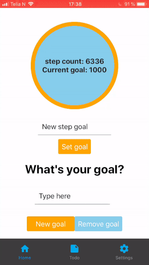
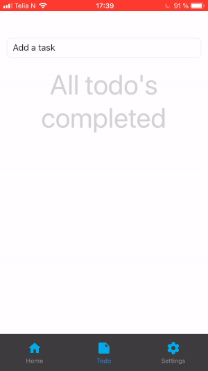
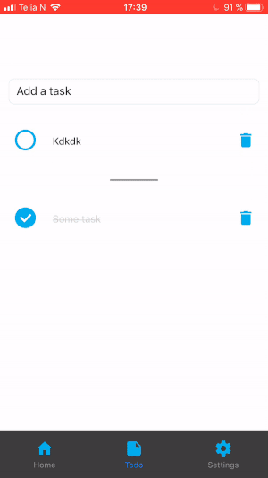

# it2810-webutvikling-h18-prosjekt-3-13

# OM PROSJEKTET
I følgende prosjektet har vi laget en Personal Information and Motivation Manager-applikasjon. App-en er basert på enkelhet og inneholder funksjonalitet for:

 - Skritteller
 - Dagens mål / dagens motivasjon
 - Gjøremål-app
 - Tilpassing av app-en til dag- eller natt-tema.

App-en består av tre screens som kan byttes mellom ved hjelp av navigasjonsfaner, også kalt tabs. 

Løsningen vi valgte for tabs var via ‘react-navigation’-biblioteket. Dette gir oss muligheten til å lage en tab-bar etter egne spesifikasjoner ved å mate inn et JSON-objekt når tab-en initialiseres. Her brukes da createBottomTabNavigator()-funksjonen.

For Todo-appen vår brukes ‘react-native-elements’ til å sette opp selve listen med gjøremål. Dette da biblioteket gjør det enkelt å legge inn ikoner i listeementet på en god måte. Ved dette fikk vi muligheten til å bruke Icon fra samme bibliotek som prop (leftIcon etc.) i ListItem. Ellers er alle andre bibliotek enten fra ’react’ eller ‘react-native’. 

Goal – som ligger under skrittelleroversikten i HomeScreen – består av en DailyGoalContainer (heretter Container), som igjen inneholder et DailyGoalForm (heretter Form). I tillegg til å inneholde et Form ligger tekstpresentasjonen i Container, som viser hvilket mål som er det gjeldende målet. Dersom det ikke finnes et mål i localstorage og brukeren ikke har satt et mål enda, vil dette målet være en standardmeling. Om det finnes et mål i localstorage blir det vist. Ved å skrive inn et nytt mål og legge til dette, blir det gamle målet skrevet over i localstorage, og det nye målet blir presentert. Det er også en knapp for å fjerne målet sitt. Da blir målet fjernet i localstorage også. Implementerte først funksjonalitet for å ha flere mål samtidig, men dette ble ikke med i den siste versjonen.

Pedometer-komponenten henter inn skrittdata fra asynkron lagring (hvis tilgjengelig). Dette hentes fra mobiltelefonens helsedata, enten det er iOS eller Android. MERK dette vil derfor ikke fungere hvis en bruker en emulator på datamaskin, da det ikke er noe data tilgjengelig å hente her, men vil fungere ved testing på mobil. Appen vil kunne kjøre på emulator, men du vil ikke få opp noen tall for skrittdata.

## TEKNOLOGI - Tutorial

### Pedometer
Vi valgte å utforske pedometer (skritteller) teknologi. Vi brukte pedometer-komponenten som er en del av expo sitt eget bibliotek. Vi fulgte eksempelet på expo sine egne nettsider: https://docs.expo.io/versions/latest/sdk/pedometer for å implementere pedometeret i appen vår. Deretter la vi til noen funksjoner selv for å generere skrittmål, og regne ut hvor langt man var kommet på vei til målet. I tillegg lagde vi funksjoner som endret litt på styling i appen (farger) basert på antall skritt gått de siste 24 timene sammenlignet med målet som er satt av brukeren. Vi valgte også denne fordi det kan bidra positivt med motivasjon i en “Personal Information and Motivation Manager”.

Under ligger en fremgangsmåte for å implementere pedometerteknologien i ditt prosjekt. Det er gjort følgende antagelser om brukerens forkunnskaper: 
 - Brukeren vet hvordan man setter opp en react-native component
 - Brukeren importerer det som trengs for å lage en react-native component
 - Brukeren bruker asyncStorage og kan hente og lagre data ved hjelp av dette

#### Fremgangsmåte for å implementere pedometerteknologien på samme måte som vi har brukt:

- Importer ProgressCircle fra ‘react-native-progress-circle’
- Importer Input fra ‘react-native-elements’
- Opprett en javascript fil 
- Importer Pedometer fra Expo
- Opprett en klasse slik som i kode-eksempelet i linken til expo sine sider.
- I tillegg til det som er i deres eksempel må du legge til:
  - State:
    - stepcountGoal (for å lagre målet brukeren har satt seg)
    - inputText (for å lagre målet brukeren taster inn fra Inputkomponent)
   - I componentDidMount():
      - Når komponenten mounter må vi hente data fra AsyncStorage, her må du laste inn data fra samme key som du lagrer stepcountGoalet ditt på. Eks: “stepCountGoal”
      - Ellers husk å inkluder _subscribe funksjonen som er med i kode-eksempelet til expo.
  - componentWillUnMount() forblir uendret
  - Vi har lagt til en funksjon som heter “updateStepGoal()”.
     - Du må ha en funksjon som sjekker hva som er skrevet i inputText komponenten i samme screen som pedometeret ditt. Den må deretter oppdatere state (stepcountGoal) til å bli det som er skrevet i inputText. Husk å ha sjekker for at det er et gyldig mål som er skrevet inn.
    - Denne funksjonen skal kalles når en trykker på en knapp på skjermen, nevnt lengre ned i denne fremgangsmåten.
    - Denne funksjonen må også oppdatere det som er lagret i AsyncStorage på keyen du har valgt deg for stepcountGoal
  - _subscribe() fra expo forblir uendret (denne funksjonen lytter etter endringer i stepcount fra iOS Core Motion eller Android Google Fit
  - Du må ha en funksjon som regner ut prosentandel av skrittmålet som er oppnådd. Vi har kalt denne for “getProgressPercent()”.
    - tar inn state-verdiene for pastStepCount og dividerer på stepGoal. Deretter har vi brukt Math.floor for å runde tallet ned til nærmeste prosent. Denne kan brukes for å ha dynamisk styling basert på skrittene som er gått i forhold til skrittmål.
  - Du må ha en funksjon som returnerer en fargeverdi basert på prosenten regnet ut av “getProgressPercent()” beskrevet over.
    - Eventuelt bare regn ut prosenten i funksjonen i seg selv, gjør som over, ta inn state sin pastStepCount og divider på stepGoal, deretter returner forhåndsbestemte fargeverdier basert på hva resultatet blir.
    - Kall denne funksjonen i render() funksjonen din, og sett fargen til en const som du kan kalle i style={foo} for å endre farger i pedometeret ditt.
  - I render() må du inkludere en Input komponent og en ProgressCircle komponent.
  - I render må du returnere en ProgressCircle som bruker getProgressPercent() for å regne ut hvor mye av sirkelen som skal farges, og som har tekst i seg som skriver ut antall skritt man har gått siste 24 timer fra state sin pastStepCount.
  - I render må du ha en Input komponent som på onChangeText kaller setState og dermed endrer state sin verdi for inputText.
  - I render har vi også en button som brukes for å kalle updateStepGoal() som da bruker state sin inputText til å oppdatere stepGoal.
  - Dette er altså alt du må inkludere for å oppnå VÅR implementasjon av teknologien. En kan returnere hva man vil i render, og Pedometer fra expo stiller ingen krav for ting som må returneres i render.
  - OBS: Man vil bli bedt om å gi appen tillatelse til å hente data fra iOS Core Motion, som vil hente fra helse-appen. Man vil kunne bli bedt om det samme på android Google Fit. Tillater man ikke dette, vil ikke pedometer finne noe lagret data, og det vil da ikke fungere. Det vil bli skrevet i appen at den ikke finner noe asynclagret data for skritt. Derfor vil det ikke fungere å teste i emulator heller.

## Testing:

Vi har forsøkt å bruke Jest til å teste applikasjonen vår, slik som det var nevnt i oppgavebeskrivelsen. Vi har hatt store problemer med Jest, og vi får ikke testet state. Dette er en stor ulempe ettersom alt i appen vår bruker state for å regne ut hva som skal sendes til skjermen. Som resultat av dette er all vår testing gjort med snapshot-testing av hvordan hver komponent rendrer. Dette møtte vi også store problemer med, med tillegget ‘react-navigation’, ettersom at vi ikke fant ut hvordan vi skal få laget snapshots som tester alle ‘tabs’ i appen. Resultatet av dette er lav code coverage i testingen.

Ettersom vi ikke bruke Enzyme har vi ikke fått testet skikkelig om callback-funksjoner fungerer. Vi har forsøkt mocking, men til lite nytte, så vi droppet det til syvende og sist. 

Hvis vi hadde fått jest og mocking til å fungere bedre ville vi ha sørget for å enhetsteste alle funksjoner. Vi ville testet hver del av koden (alle funksjoner), og forsøkt å teste flere deler av koden samtidig. Vi ville passert inn verdier som er forventet, samt ikke forventede verdier. Vi ville testet verdier som er alt for høye, alt for lave (negative) samt 0, ettersom disse verdiene ofte kan føre til feil. Vi ville også prøvd å passere inn paramtere som er av feil type, som bool til noe som forventer string etc. 

Ellers har vi kontinuerlig gjennom utviklingen av appen testet builden på både iOS gjennom Xcode sin emulator, og gjennom iPhone i virkeligheten og på to android telefoner i virkeligheten. 

## Installasjon og kjøring av appen vår.

 - Git clone i valgfri mappe på datamaskinen din.
 - Endre directory slik at du befinner deg i it2810-webutvikling-h18-prosjekt-3-13 mappen. 
     - Her må du kjøre npm install
     - Deretter kjør expo start
        - Da skal du få opp Metro Bundler ready i browseren din.
 - Kjør nå appen gjennom mobilen din med beskrivelsen under:

### Kjøre appen på android
Hvis du ønsker å prøve å appen gjennom expo på mobil må du sørge for å bruke QR-kode scanneren på android-telefonen din når du laster inn appen, hvis ikke vil ikke alltid async loading av steps fra telefonen sine helse-data fungere ordentlig. 

### Kjøre appen på iOS
For å kjøre på iPhone må du sende mail eller sms til deg selv fra nettleseren, og deretter åpne på mobil, ettersom expo og iOS ikke lengre lar deg bruke QR scanner. 

### Kjøre appen på emulator
Du kan også kjøre på emulator på datamaskinen, men da vil det ikke være noe tilgjengelig data for skrittelleren, og du vil derfor ikke få full funksjonalitet i appen.

Her er Gif-filer som raskt viser hvordan appen ser ut, og det meste av funksjonaliteten i appen.
  

Kilder:
- Inspirasjon til Todo-liste: https://hellokoding.com/todo-app-with-react-native/
- React-native-navigation: https://reactnavigation.org/docs/en/tab-based-navigation.html
  - Trenger følgende npm installasjon:
    - 'npm install --save react-navigation'
- Expo sin pedometer-komponent: https://docs.expo.io/versions/latest/sdk/pedometer
